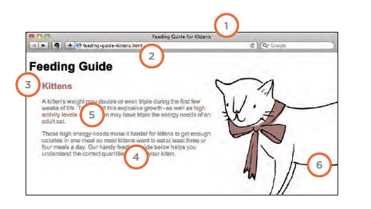

# IMAGES 

## control size of image:

You can control the size of an
image using the width and
height properties in CSS, just
like you can for any other box.

## centering image using css

By default, images are inline
elements. This means that they
flow within the surrounding text.
In order to center an image, it
should be turned into a blocklevel
element using the display
property with a value of block.

## Background Images :

The background-image
property allows you to place
an image behind any HTML
element. This could be the entire
page or just part of the page. By
default, a background image will
repeat to fill the entire box.

## Repeating Images

* repeat:

The background image is
repeated both horizontally and
vertically (the default way it
is shown if the backgroundrepeat
property isn't used).

* repeat-x:

The image is repeated
horizontally only (as shown in
the first example on the left).
repeat-y
The image is repeated vertically
only.

* no-repeat

The image is only shown once.
The background-attachment
property specifies whether a
background image should stay in
one position or move as the user
scrolls up and down the page. It
can have one of two values:

fixed:

The background image stays in
the same position on the page.

scroll:

The background image moves
up and down as the user scrolls
up and down the page.

## Background Position:

When an image is not being
repeated, you can use the
background-position
property to specify where in the
browser window the background
image should be placed.

* * * 

# PRACTICAL INFORMATION

## Search Engine obtimization (seo)

Search engine optimization (or
SEO) is the practice of trying
to help your site appear nearer
the top of search engine results
when people look for the topics
that your website covers.

* In every page of your website there are seven key places where keywords
(the words people might search on to find your site) can appear in order
to improve its findability.




1 -  Page Title

The page title appears at the top
of the browser window or on the
tab of a browser. It is specified in
the ```<title>``` element which lives
inside the ```<head>``` element.

2 - URL / Web Address

The name of the file is part of
the URL. Where possible, use
keywords in the file name.

3 -  Headings

If the keywords are in a heading
```<hn>``` element then a search
engine will know that this page is
all about that subject and give it
greater weight than other text.

4 - Text

Where possible, it helps to
repeat the keywords in the main
body of the text at least 2-3
times. Do not, however, over-use
these terms, because the text
must be easy for a human to
read.

5 - Link Text

Use keywords in the text that
create links between pages
(rather than using generic
expressions such as "click here").
6: Image Alt Text
Search engines rely on you
providing accurate descriptions
of images in the alt text. This
will also help your images show
up in the results of image-based
searches.

7 - Page Descriptions

The description also lives inside
the ```<head>``` element and is
specified using a ```<meta>``` tag.
It should be a sentence that
describes the content of the
page. (These are not shown in
the browser window but they
may be displayed in the results
pages of search engines.)
Never try to fool search engines!
They will penalize you for it. For
example, never add text in the
same color as the background of
the page as they can detect this.

## How to Identify Keywords and Phrases:

1. Brainstorm

List down the words that
someone might type into
Google to find your site. Be sure
to include the various topics,
products or services your site is
about.

2. Organize

Group the keywords into
separate lists for the different
sections or categories of your
website.

3. Research

There are several tools that let
you enter your keywords and
then they will suggest additional
keywords you might like to
consider, such
 as: adwords.google.co.uk/
select/KeywordToolExternal

4. Compare

It is very unlikely that your
site will appear at the top of
the search results for every
keyword. This is especially true
for topics where there is a lot
of competition. The more sites
out there that have already been
optimized for a given keyword,
the harder it will be for you to
rise up the search results when
people search on that term.

5. Refine:

Now you need to pick which
keywords you will focus on.
These should always be the ones
that are most relevant to each
section of your site.

6. Map

Now that you have a refined list
of keywords, you know which
have the most competition, and
which ones are most relevant,
it is time to start picking which
keywords you will use for each
page.